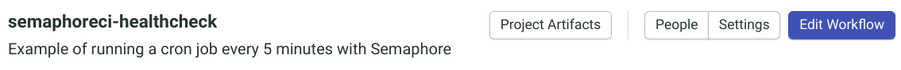

# How to Run a Cloud-based `cron` Job Every 5 Minutes with Semaphore

[] Fix the 'user experience' of forking the repo to follow the tutorial. How best to provide this given how Semaphore finds .semaphore on master?

[] Open Log-in link in a new tab?

[] Merge set-up-semaphore branch into master before setting up schedule?  It's a bit yucky configuring the scheduler to use the `set-up-semaphore` branch, but extra steps to have the reader merge that branch in...

[] Use inline CSS for shadows on images? e.g.


[] Adjust size/resolution of screenshots?

[] Elaborate on Slack integration (this is a trial task - will the article ever be published?)

### Introduction

`cron` is a Unix job scheduler that runs commands periodically according to a schedule given by the user, known as the 'crontab'.  Scheduled jobs can be used to automate routine, repetitive tasks and receive notifications or tasks that you don't want to run for every push.

This tutorial shows how to use Semaphore's workflow-scheduler/`cron` feature. The step-by-step example creates a project with a super-simple pipeline that runs a `bash` script to check that a website is up (returning a 200 HTTP response) every 5 minutes, and notify a Slack channel if the website gives an unexpected response.

### Prerequisites

To follow this tutorial, you will need:

* Git, a GitHub account and a working knowledge of forking, branches, committing and pushing.
* A Semaphore account. You can get one for free at semaphoreci.com.

Let's get started!

## Create your Website Healthcheck Repository in GitHub

To get started quickly, you can fork the demo repository.  This branch contains just the health-check script and a README, so you can follow along to create the Semaphore configuration files.

The `run_healthcheck.sh` `bash`-script works as follows:

* send an HTTP request to an `ENDPOINT` (Google in the example) using `curl`
* store the HTTP response code in `status_code`
* check the response code and set the script's `exit` code as follows:
 * 1 if the response code is not `200` (signifying a status of `OK`)
 * 0 if the response code is `200`

The script's exit code is arguably the most important detail, as this is what Semaphore will check to determine success or failure when it runs the script.

``` bash
#!/bin/bash

# run_healthcheck.sh

ENDPOINT=https://www.google.com

status_code=$(curl --write-out %{http_code} --silent --output /dev/null $ENDPOINT)

if [[ "$status_code" -ne 200 ]] ; then
  echo "$ENDPOINT status $status_code"
  exit 1
else
  echo "$ENDPOINT OK"
  exit 0
fi

```

## Create your Semaphore project and choose a starter Workflow

* [Log in to Semapahore](https://id.semaphoreci.com/login)
* Use the **+** button next to the Projects heading in the left side bar to add a new project to your account

* Select your repository from the list

* Wait for Semaphore to set up the project and connect it to GitLab
* When presented with the **Invite People** page, skip straight to the **Workflow Builder**

* Choose **Single job** as your starter workflow

* In the workflow configuration pane, choose to **Customize it first**


## Customize your Semaphore Workflow

Here's a very quick overview of the main modelling concepts used in Semaphore Workflows:

* Ultimately, work done by running **Commands**.
* Commands are grouped into sequences within **Jobs**.
* Jobs are collected into **Blocks**, where the Jobs can run in parallel.
* Finally, Blocks are arranged into a **Pipeline**, which sequences and triggers inter-related Blocks.

You can find more detail on the [concepts in the Workflow model in the docs](https://docs.semaphoreci.com/guided-tour/concepts/).

For this tutorial, we want the pipeline to run a command that executes our `run_healthcheck.sh` script.  For that, we need to create a single Job in a single Block.

* Add a command to execute our script to the existing Job
 * append `./run_healthcheck.sh` to Job

 

 * Optionally, rename the Job to something more meaningful

 

 * You'll see that, as you rename the Job, the Pipeline diagram is instantly updated to help you understand the entirety of the configuration

 

The curious can learn more about the [`checkout` command that appears in the job in the docs](https://docs.semaphoreci.com/reference/toolbox-reference/#checkout).  In short, the `checkout` command makes the code in your `git` repository available in the environment where the job's commands are executed.

## Run the Workflow and check the output

* Click **Run the workflow**.  All workflows execute from version-controlled configuration stored in your repository, so you can always reproduce the result of a workflow.  The dialog that pops up allows you customise the branch and commit message that will be pushed to your repository.


* Clicking **Start** will cause Semaphore to push the new `.semaphore/semaphore.yml` file to the named branch, which it will create if necessary.  The pipeline will run and in a few seconds the result will be displayed.


The pipeline, with it's single job, passed.  Maybe you've had the experience in the past where, when something seems to work first time, nothing was happening at all? We can check that the job passed for the expected reason by checking the log.

* Simply click on the **Healthcheck Job** to see the log.


Line 83 is the output from the `run_healthcheck.sh` script, which has run and succeeded with a `0` exit code.

## Schedule your pipeline to run every 5 minutes

The configuration we've done so far has created a pipeline that will be run, according to Semaphore's default settings, whenever there is a push to the repository.  The next stage is for us to schedule the running of the pipeline.

* Return to your new project's main page by clicking the project name in the left side-bar
* On the project's page, click **Settings**



* Scroll to the **Scheduler** section, and click **Create New Schedule**


* Fill in the **Name of the Schedule** field
* Set the branch to the one you just added the workflow to (`set-up-semaphore` by default)
* Set the pipeline file to use (`.semaphore/semaphore.yml` by default)


* Type a schedule into the **When** field for every 5 minutes using `cron` syntax: `*/5 * * * *`. Help with the syntax can be found by following the **Crontab Guru** link.


* Click **Create**!

That's it!  You're done! To see the result of the scheduled run, return to your new project's main page.


You can see the history of results for a branch by clicking on the branch name.


## Conclusion

You've seen how quick and simple it is to set up a Semaphore workflow from scratch and have it run according to a schedule.

Currently, the results are visible from within your Semaphore account.  An even more useful setup can be achieved by having Semaphore notify you should the workflow ever detect a failure.  To find out more about that, take a look at this [Introduction to Slack Integration](https://semaphoreci.com/blog/2014/03/06/slack-integration.html) and the [Slack Notifications docs](https://docs.semaphoreci.com/essentials/slack-notifications/)

Thanks for reading this tutorial!  If you'd like to find out more about what Semaphore CI is being used for, head over to the [Continuous Delivery Blog](https://semaphoreci.com/blog)!
